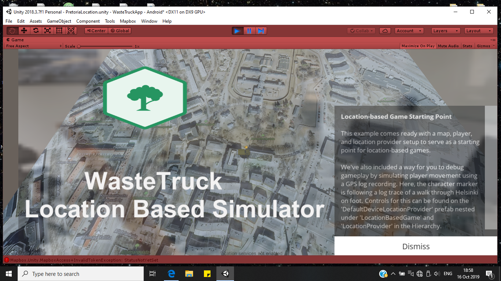
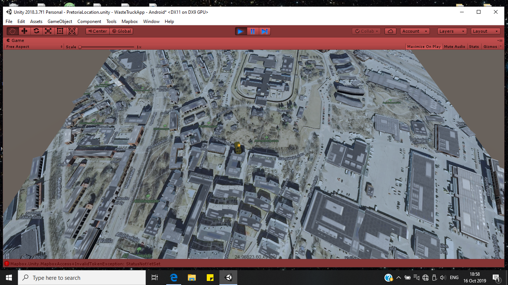

# Mapbox-Augmented-Reality-App
Wastetruck locator augmented reality app created using Mapbox sdk and Unity. That tracks a truck drivers fone and displays the location using Mapbox

Truck is seen moving on the street 

